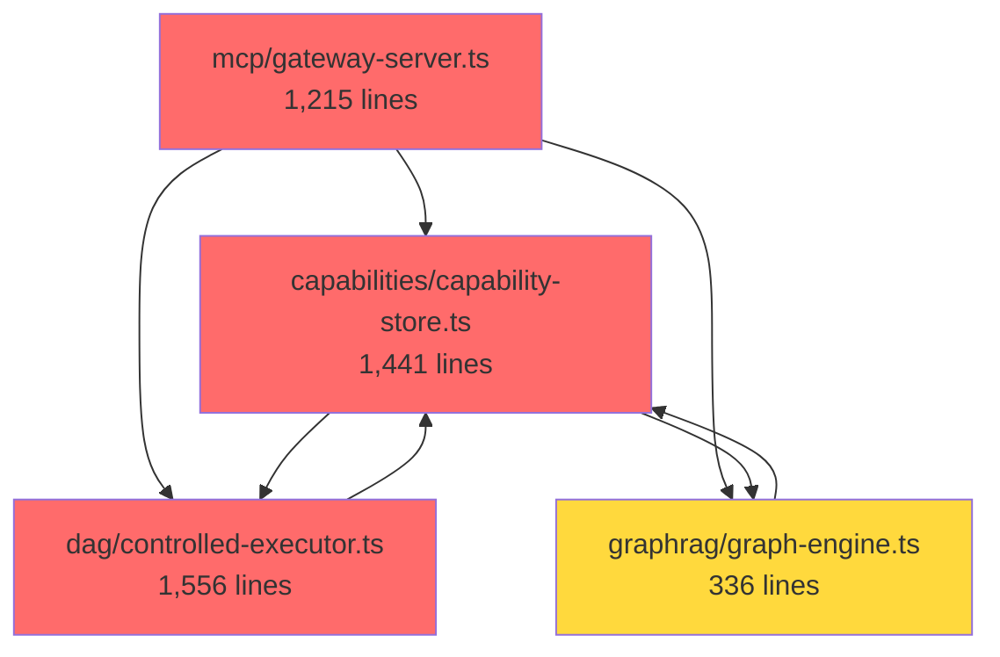

# Architecture Refactoring - Phase 2

**Status:** Draft
**Priority:** P1 - High
**Created:** 2025-12-29
**Depends On:** `tech-spec-large-files-refactoring.md` (Phases 1-4 completed)

---

## Executive Summary

Phase 2 addresses architectural issues that emerged after Phase 1:

1. **New God Classes**: `static-structure-builder.ts` (2,399 lines) was not in scope
2. **File Re-inflation**: Some refactored files have grown back
3. **Type File Explosion**: `capabilities/types.ts` (1,237 lines)
4. **Circular Coupling**: Bidirectional dependencies between modules
5. **Missing Abstractions**: No interfaces, heavy coupling to concrete classes

**New Libraries:**
- **[Hono](https://hono.dev)** - HTTP routing (`jsr:@hono/hono@^4`)
- **[diod](https://github.com/artberri/diod)** - DI container (`npm:diod@^3.0.0`)

---

## Problem Statement

### Code Metrics (2025-12-29)

| File | Lines | Issues | Priority |
|------|-------|--------|----------|
| `static-structure-builder.ts` | 2,399 | God class, mixed concerns | **P0** |
| `controlled-executor.ts` | 1,556 | Re-inflated from 841 lines | **P0** |
| `gateway-server.ts` | 1,215 | Re-inflated, 10-param constructor | **P0** |
| `capability-store.ts` | 1,441 | 6 responsibilities | **P1** |
| `capabilities/types.ts` | 1,237 | 85+ types in 1 file | **P1** |
| `sandbox/executor.ts` | 1,302 | Phase 5 pending | **P1** |

### Circular Dependencies



**Legend:** 🔴 Red: > 1,000 lines | 🟡 Yellow: 500-1,000 lines | ↔️ Bidirectional: Circular dependency

---

## Document Structure

| Document | Content | When to Use |
|----------|---------|-------------|
| [quick-wins.md](./quick-wins.md) | QW-1 to QW-5 | Start immediately |
| [phase-2.1-dependency-injection.md](./phase-2.1-dependency-injection.md) | diod, interfaces, domain types | Sprint 1 |
| [phase-2.2-god-classes.md](./phase-2.2-god-classes.md) | Refactor large files | Sprint 2 |
| [phase-2.3-type-splitting.md](./phase-2.3-type-splitting.md) | Split type files | Sprint 3 |
| [phase-2.4-sandbox.md](./phase-2.4-sandbox.md) | Sandbox executor | Sprint 3 |
| [phase-2.5-patterns.md](./phase-2.5-patterns.md) | Design patterns, CQRS | Sprint 5 |
| [phase-2.6-testing.md](./phase-2.6-testing.md) | Test architecture | Sprint 6 |
| [phase-2.7-deno-native.md](./phase-2.7-deno-native.md) | Deno APIs, import maps | Ongoing |

---

## Target Architecture

### Design Principles

1. **Strict Layering**: No upward dependencies
2. **Dependency Inversion**: Depend on interfaces, not implementations
3. **Type Modularity**: Max 300 lines per type file
4. **Single Responsibility**: One concern per class (target: <500 lines)

### Layered Architecture

```
┌─────────────────────────────────────────┐
│  Presentation Layer (mcp-server, web)  │  ← User-facing
├─────────────────────────────────────────┤
│  Application Layer (use-cases)          │  ← Business logic orchestration
├─────────────────────────────────────────┤
│  Domain Layer (entities, interfaces)    │  ← Core business logic
├─────────────────────────────────────────┤
│  Infrastructure (db, vector, events)    │  ← Technical implementations
└─────────────────────────────────────────┘

Rules:
- Each layer can ONLY depend on layers below
- NO circular dependencies between layers
- Infrastructure injects via interfaces (DI)
```

---

## Success Metrics

| Metric | Current | Target | Validation |
|--------|---------|--------|------------|
| **Max file size** | 2,399 lines | 600 lines | `wc -l src/**/*.ts` |
| **Circular deps** | 3+ cycles | 0 cycles | `deno info --json` |
| **Type file size** | 1,237 lines | 300 lines | Manual inspection |
| **Interface coverage** | 0% | 80% | Count interfaces vs classes |
| **Test coverage** | ~60% | >85% | `deno task coverage` |
| **Architecture Tests** | 0 | 4 test files (QW-5) | `deno task test:arch` |
| **DI Container** | Manual (10 params) | diod graph-based | Startup validation |
| **HTTP Router LOC** | ~220 lines | ~50 lines (Hono) | `wc -l` |

---

## Timeline (12 weeks)

### Sprint 1-2: Foundation (Weeks 1-4)
- **QW-1 to QW-5**: Quick wins (parallel)
- **Phase 2.1**: Domain types, interfaces, diod setup

### Sprint 3-4: God Classes (Weeks 5-8)
- **Phase 2.2**: Refactor static-structure-builder, controlled-executor
- **Phase 2.3**: Split type files
- **Phase 2.4**: Sandbox executor

### Sprint 5-6: Patterns & Testing (Weeks 9-12)
- **Phase 2.5**: Design patterns, CQRS, events
- **Phase 2.6**: Test architecture
- **Phase 2.7**: Deno-native patterns (ongoing)

---

## Next Steps

1. **Review & Approve**: Team reviews this spec
2. **Quick Wins First**: Start with QW-3 (interfaces) + QW-4 (Hono) + QW-5 (tests) in parallel
3. **Install libs**: Add diod + Hono to `deno.json`
4. **Kickoff Sprint 1**: Domain types extraction + diod bootstrap

---

## References

### Project References
- **Phase 1 Spec**: `docs/tech-specs/tech-spec-large-files-refactoring.md`
- **ADR-036**: Event Bus pattern
- **ADR-052**: Two-level DAG

### Phase 2 Libraries
- **Hono**: https://hono.dev
- **diod**: https://github.com/artberri/diod

### Architecture Patterns
- **Clean Architecture**: Robert C. Martin
- **CQRS**: Greg Young
- **Dependency Injection**: Martin Fowler
