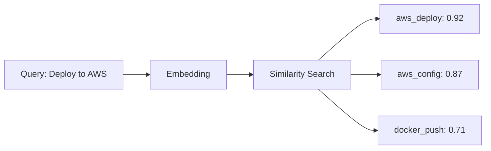
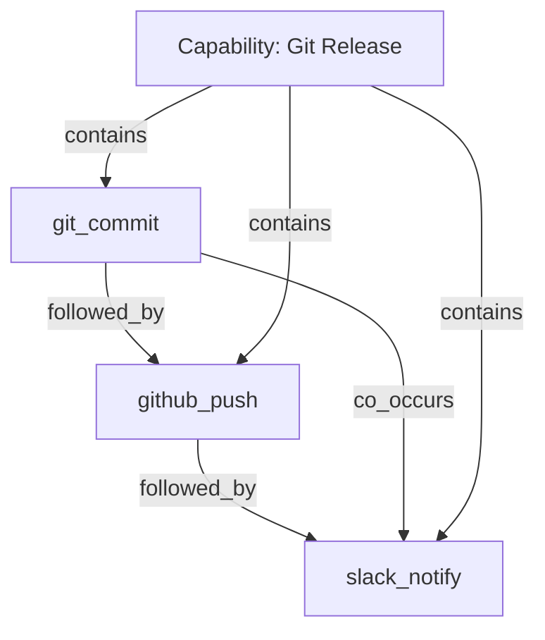
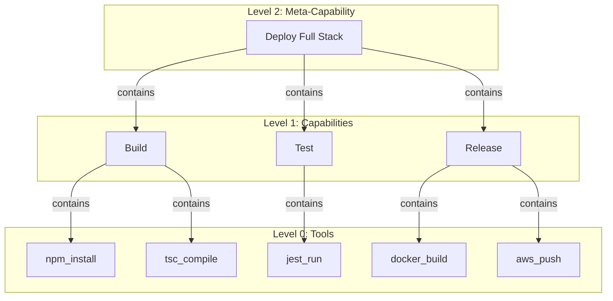
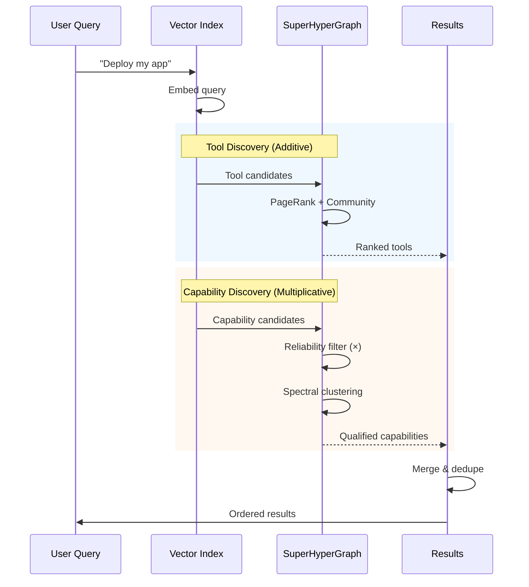

# GraphRAG + VectorRAG: Why You Need Both

> It's not either/or. It's both/and.

## The False Dichotomy

The internet loves a good "X vs Y" debate. GraphRAG vs VectorRAG is no exception.

But here's the thing: **they solve different problems**.

| Approach | Question It Answers |
|----------|-------------------|
| VectorRAG | "What's *similar* to this?" |
| GraphRAG | "What's *related* to this?" |

Similar ≠ Related. And for AI agents, you need both.

## VectorRAG: The Similarity Engine

Vector embeddings capture **semantic similarity**. Two pieces of text that mean similar things will have similar vectors.



**Great for:**
- Finding relevant tools by intent
- Matching user queries to capabilities
- Discovering semantically similar patterns

**Blind to:**
- Execution order ("X must come before Y")
- Structural relationships ("X contains Y")
- Co-occurrence patterns ("X and Y often together")

## GraphRAG: The Relationship Engine

Graphs capture **structural relationships**. Nodes are entities, edges are how they relate.



**Great for:**
- Understanding tool dependencies
- Finding execution sequences
- Detecting capability clusters
- Importance ranking (PageRank)

**Blind to:**
- Semantic meaning of new tools
- Intent matching
- Fuzzy similarity

---

## Beyond Simple Graphs: The SuperHyperGraph

Here's where most "GraphRAG" articles stop. But for AI agents that orchestrate complex workflows, **simple graphs aren't enough**.

### The Problem With Regular Graphs

A standard graph connects pairs of nodes. A hypergraph can connect N nodes in one edge. But what happens when you need to express:

> *"The Deploy capability contains the Build capability, which itself contains compile, link, and test tools"*

That's **recursive nesting**—a capability containing capabilities containing tools. Neither graphs nor hypergraphs can represent this cleanly.

### Enter the n-SuperHyperGraph

Think of it like Russian nesting dolls for your workflow structure:

```
Standard Graph     →  Hypergraph           →  SuperHyperGraph
(pairs only)          (N nodes per edge)      (recursive nesting)
  A ── B               {A, B, C, D, E}         {{A,B}, {C, {D,E}}}
```

In PML, we use an **unbounded SuperHyperGraph** with natural hierarchy levels:

| Level | What It Represents | Example |
|-------|-------------------|---------|
| 0 | **Tools** | `read_file`, `parse_json`, `http_post` |
| 1 | **Capabilities** | "Parse Config" = {read_file, parse_json} |
| 2+ | **Meta-Capabilities** | "Deploy" = {Build, Test, Release} |
| n | **Emergent compositions** | No depth limit |



<details>
<summary><strong>Technical Deep Dive: Edge Types & DAG Constraints</strong></summary>

Not all relationships are equal. PML uses 4 edge types with different cycle rules (following DASH constraints from Fujita 2025):

| Edge Type | Allows Cycles? | Purpose |
|-----------|----------------|---------|
| `contains` | **No** (strict DAG) | Composition hierarchy |
| `dependency` | **No** (strict DAG) | Execution prerequisites |
| `provides` | Yes | Data flow between tools |
| `sequence` | Yes | Temporal co-occurrence patterns |

**Why the difference?**
- `contains` cycles are logical impossibilities (A contains B contains A?)
- `dependency` cycles create deadlocks
- `provides` and `sequence` represent observed patterns, not constraints

</details>

---

## Tools vs Capabilities: A Critical Distinction

Most RAG articles treat "tools" as a monolith. But there are two fundamentally different things to discover:

| Aspect | Tools | Capabilities |
|--------|-------|--------------|
| **Source** | MCP servers (external) | Learned from execution (emergent) |
| **Scope** | Single atomic operation | Workflow composition |
| **Complexity** | Fixed | Recursive (can nest) |
| **Discovery** | "Find me a tool that does X" | "Find me a workflow that achieves Y" |
| **Example** | `github:create_issue` | "Bug Triage" = {search, analyze, create_issue, notify} |

**Key insight:** Tools are **given**. Capabilities are **learned**.

When an agent successfully completes a multi-tool workflow, that pattern becomes a reusable capability—stored with its intent, constituent tools, and reliability score.

---

## Discovery Algorithms: Different Formulas for Different Targets

Here's what most articles miss: **you can't use the same algorithm for tools and capabilities**.

### Tool Discovery: Additive Formulas (Permissive)

When searching for tools, we **combine weak signals**. A tool that scores moderately on semantics AND graph context is probably relevant.

**Active Search (user intent):**
```
Score = α × SemanticScore + (1-α) × GraphScore
```

Where α adapts **per node** based on embedding coherence—comparing semantic (BGE-M3) vs structural (spectral) embeddings.

**Passive Suggestion (workflow context):**
```
Score = 0.6 × CoOccurrence + 0.3 × CommunityBoost + 0.1 × Recency
```

Uses Louvain clustering for community detection and heat diffusion to propagate confidence.

### Capability Discovery: Multiplicative Formulas (Strict)

Capabilities require **higher confidence**. A capability with great semantic match but poor reliability? Disqualified.

**Active Match (user intent):**
```
Score = SemanticSimilarity × ReliabilityFactor
```

If reliability < 0.5, the score becomes 0. One bad factor vetoes the whole match.

**Strategic Discovery (workflow context):**
```
Score = ToolsOverlap × (1 + SpectralClusteringBoost)
```

- `ToolsOverlap`: How many capability tools are already in use
- `SpectralClusteringBoost`: Whether capability is in same graph cluster as current context

<details>
<summary><strong>Why Multiplicative for Capabilities?</strong></summary>

Capabilities represent **proven patterns**. Suggesting an unreliable capability wastes user time and erodes trust.

With additive formulas, a capability could score high despite having 20% success rate (great semantics + graph context compensate). Multiplicative formulas prevent this:

```
Additive:   0.9 (semantic) + 0.1 (reliability) = 1.0  ✗ misleading
Multiplicative: 0.9 × 0.2 = 0.18  ✓ honest
```

Tools don't need this strictness—a tool can be relevant even if rarely used. But suggesting a failing workflow? That's harmful.

</details>

---

## The Complete Hybrid Architecture

Putting it all together:

| Stage | Method | Target | Formula Type |
|-------|--------|--------|--------------|
| **Intent Match** | Vector similarity | Tools & Capabilities | — |
| **Tool Ranking** | Hybrid (Vector + Graph) | Tools | Additive |
| **Capability Match** | Semantic × Reliability | Capabilities | Multiplicative |
| **Sequencing** | Graph traversal | Both | DAG constraints |
| **Clustering** | Spectral analysis | Capabilities | SuperHyperGraph |
| **Boosting** | Co-occurrence | Tools | Additive |

### The Flow



---

## When To Use What

| Situation | Primary Method | Secondary |
|-----------|----------------|-----------|
| New tool, never seen | Vector only | — |
| Known tool, finding sequence | Graph traversal | Vector (fallback) |
| Ambiguous query | Vector | Graph (structure) |
| Execution planning | Graph DAG | Vector (alternatives) |
| Capability discovery | Multiplicative match | — |
| Tool suggestion in workflow | Additive scoring | Community boost |

---

## The Bottom Line

Don't pick sides. But don't stop at "use both" either.

For AI agents that orchestrate real workflows:

1. **Vectors** give you semantic understanding
2. **Graphs** give you structural knowledge
3. **SuperHyperGraphs** give you recursive composition
4. **Different formulas** for different targets—permissive for tools, strict for capabilities

The question isn't "GraphRAG or VectorRAG?"

It's "How do I structure *both* to match *what* I'm discovering?"

---

## References

- Lewis, P. et al. (2020). "Retrieval-Augmented Generation." NeurIPS.
- Microsoft Research. (2024). "GraphRAG: Unlocking LLM discovery on narrative private data."
- Smarandache, F. (2019). "n-SuperHyperGraph and Plithogenic n-SuperHyperGraph." Neutrosophic Sets and Systems.
- Fujita, S. et al. (2025). "DASH: Directed Acyclic SuperHyperGraph for AI Agent Orchestration."

#GraphRAG #VectorRAG #SuperHyperGraph #AIArchitecture #Hybrid
