# Why We Use n-SuperHyperGraphs (And What That Even Means)

> From simple edges to recursive hyperedges: the data structure journey that changed how we model AI learning

## Skills Aren't Edges

When an AI agent learns to "deploy to production," it's not learning that GitHub connects to AWS. It's learning an entire **orchestration**—a coordinated sequence involving 5, 10, maybe 20 tools working together.

And sometimes, that orchestration is part of an even bigger one.

Standard knowledge graphs can't represent this. They give you nodes and edges—pairs of connected things. But skills are *containers*. They hold tools, sequences, and sometimes *other skills*.

```mermaid
flowchart TD
    subgraph BEFORE["❌ Standard Graph"]
        G1[GitHub] --- F1[Filesystem] --- A1[AWS]
    end

    subgraph AFTER["✅ What We Need"]
        subgraph DEPLOY["🚀 Deploy to Prod"]
            subgraph TEST["🧪 Tests"]
                J[Jest] --> C[Coverage]
            end
            G2[GitHub] --> D[Docker] --> A2[AWS]
        end
    end
```



We needed a data structure that could represent:
1. **Groups of tools** (not just pairs)
2. **Nested groups** (capabilities containing capabilities)
3. **Infinite depth** (meta-meta-meta-capabilities)

## The Evolution: Graph → Hypergraph → SuperHyperGraph

```mermaid
flowchart TD
    subgraph G1["1️⃣ Graph"]
        A[A] --- B[B] --- C[C]
    end
    subgraph G2["2️⃣ Hypergraph"]
        D[A] & E[B] & F[C] -.-> H{Hyperedge}
    end
    subgraph G3["3️⃣ SuperHyperGraph"]
        I[Tool] --> J[Cap]
        K[Tool] --> J
        J --> L[Meta]
    end
    G1 -->|"+N nodes"| G2 -->|"+nesting"| G3
```



## Step 1: The Hypergraph

A **hypergraph** solves the first problem by allowing edges to connect *any number* of nodes:

```
Graph edge:       A ── B           (connects 2 nodes)
Hyperedge:        {A, B, C, D, E}  (connects N nodes)
```

Now we can represent "Deploy" as a hyperedge containing all its tools. Progress.

But we immediately hit another wall: **what about capabilities that contain other capabilities?** A hyperedge can group nodes—but it can't contain other hyperedges.

## Step 2: The SuperHyperGraph

In 2019, mathematician Florentin Smarandache formalized the **n-SuperHyperGraph**—a structure where:

- Vertices can be *sets of vertices* (SuperVertices)
- Edges can be *sets of edges* (SuperHyperEdges)
- This nesting can go **n levels deep**

For Casys PML, this was exactly what we needed:

| Level | What it represents | Example |
|-------|-------------------|---------|
| 0 | Tools | `file_read`, `github_push` |
| 1 | Capabilities | "Git Workflow" = {`file_read`, `git_commit`, `github_push`} |
| 2 | Meta-Capabilities | "Release Process" = {"Git Workflow", "Run Tests", "Deploy"} |
| n | Meta^n-Capabilities | Unbounded nesting |

The "n" in n-SuperHyperGraph means the depth is unlimited. Perfect for emergent, recursive learning.

## Why This Matters for AI Agents

Traditional RAG (Retrieval-Augmented Generation) stores facts. But an AI agent doesn't just need facts—it needs **skills**. And skills are hierarchical.

With n-SuperHyperGraphs:

1. **Learning is compositional**: When the agent discovers a new capability, it can be built from existing capabilities
2. **Retrieval is contextual**: Asking "how do I deploy?" retrieves the whole skill tree, not just related tools
3. **Emergence is natural**: Complex behaviors arise from combining simpler ones

```mermaid
flowchart TD
    subgraph META["🎯 Release Process"]
        subgraph CAP1["📦 Git"]
            T1[commit] --> T2[push]
        end
        subgraph CAP2["🧪 Tests"]
            T3[jest] --> T4[coverage]
        end
        subgraph CAP3["☁️ Deploy"]
            subgraph DOCKER["🐳 Docker"]
                T5[build] --> T6[push]
            end
            T7[ecs_update]
        end
        CAP1 --> CAP3
        CAP2 --> CAP3
        DOCKER --> T7
    end
```



Notice the recursion: capabilities contain tools *or other capabilities*, to any depth. The "Docker Build" sub-capability lives inside "Deploy AWS," which lives inside "Release Process."

## The Academic Foundation

We didn't invent this. We're standing on the shoulders of mathematicians:

- **Smarandache (2019)**: Defined n-SuperHyperGraph in "Neutrosophic Sets and Systems"
- **Fujita (2025)**: Extended to DASH (Directed Acyclic SuperHypergraph) with formal proofs for topological ordering

What we *did* do is apply it to AI agent learning—something the papers describe as "future work."

## Practical Implications

### Edge Constraints

Not all edges are equal. Our SuperHyperGraph uses four edge types with different cycle rules:

| Edge Type | Cycles? | Rationale |
|-----------|:-------:|-----------|
| `contains` | ❌ DAG | A capability can't contain itself |
| `dependency` | ❌ DAG | Execution order must be deterministic |
| `provides` | ✅ | Data can flow bidirectionally |
| `sequence` | ✅ | Temporal patterns can loop (retry, poll) |


### Query Examples

The structure enables powerful queries:

| Query | What It Returns |
|-------|----------------|
| "Who uses github_push?" | git-workflow → release-v2 (ancestors) |
| "Entry points?" | Capabilities with no dependencies (roots) |
| "What's in release-v2?" | Complete nested skill tree (descendants) |

## What's Next

We're exploring **SuperHyperGraph Attention Networks (SHGAT)**—applying attention mechanisms to navigate these recursive structures. The math exists (Fujita 2025), but no production implementation yet.

Casys PML might be the first.

---

## TL;DR

| Problem | Solution |
|---------|----------|
| Graphs only connect pairs | Hypergraphs connect N nodes |
| Hyperedges can't nest | SuperHyperGraphs allow recursive containment |
| Fixed depth structures | n-SuperHyperGraphs have unlimited depth |
| Skills stored as flat facts | Skills stored as composable, hierarchical trees |

---

## References

- Smarandache, F. (2019). "n-SuperHyperGraph." *Neutrosophic Sets and Systems*, 30, 11-18.
- Fujita, T. & Smarandache, F. (2025). "Directed Acyclic SuperHypergraphs (DASH)." Engineering Archive.
